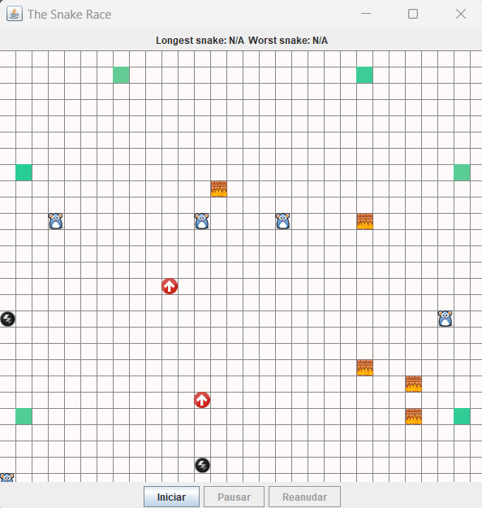
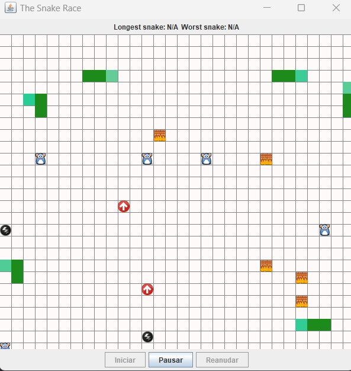
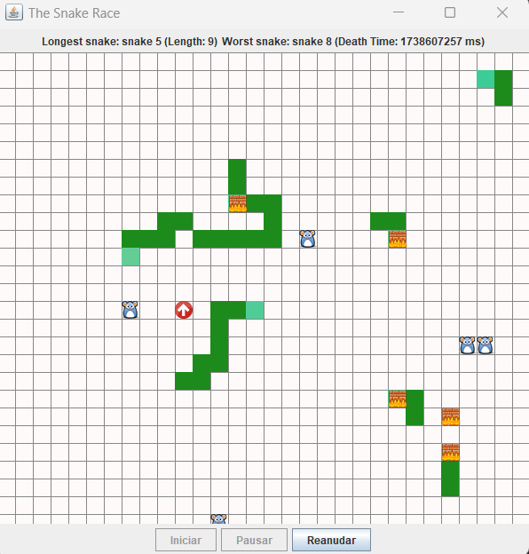
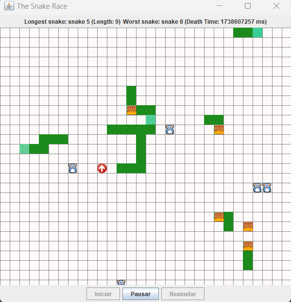

# ARSW-LAB02-PART2

## Integrantes

- Andrea Valentina Torres Tobar
- Andres Serrato Camero

## Descripción

SnakeRace es una versión autónoma, multi-serpiente del famoso juego 'snake', basado en el proyecto de João Andrade -este ejercicio es un 'fork' del mismo-. En este juego:

- N serpientes funcionan de manera autónoma.
- No existe el concepto de colisión entre las mismas. La única forma de que mueran es estrellándose contra un muro.
- Hay ratones distribuídos a lo largo del juego. Como en el juego clásico, cada vez que una serpiente se come a un ratón, ésta crece.
- Existen unos puntos (flechas rojas) que teletransportan a las serpientes.
- Los rayos hacen que la serpiente aumente su velocidad.

## 2. Problemas Identificados y Soluciones

### 2.1. Posibles Condiciones de Carrera

Se identificaron varias condiciones de carrera en el código original:

#### Regiones Críticas:

- Acceso a `Board.gameboard`: Varias serpientes pueden intentar modificar la misma celda del tablero al mismo tiempo.
- Modificación de `Board.turbo_boosts`, `Board.jump_pads`, y `Board.food`: Estas estructuras de datos son accedidas y modificadas por múltiples hilos sin sincronización.

#### Solución:
Se sincronizó el acceso a `Board.gameboard`, `Board.turbo_boosts`, `Board.jump_pads`, y `Board.food` utilizando bloques `synchronized`.

### 2.2. Uso Inadecuado de Colecciones

El código original utilizaba colecciones no seguras para hilos, como LinkedList y arrays estáticos.

#### Solución:

Se reemplazó `LinkedList<Cell>` por `CopyOnWriteArrayList<Cell>` para snakeBody.
Se sincronizó el acceso a los arrays `Board.turbo_boosts`, `Board.jump_pads`, y `Board.food`.

```
private CopyOnWriteArrayList<Cell> snakeBody = new CopyOnWriteArrayList<>();
```

### 2.3. Uso Innecesario de Esperas Activas

El código original utilizaba un bucle de espera activa en el método `init` de la clase SnakeApp.

### Solución:

Se reemplazó el bucle de espera activa con un CountDownLatch.

```
private void init() {
for (int i = 0; i != MAX_THREADS; i++) {
snakes[i] = new Snake(i + 1, spawn[i], i + 1, latch);
snakes[i].addObserver(board);
thread[i] = new Thread(snakes[i]);
thread[i].start();
}

    frame.setVisible(true);

    new Thread(new Runnable() {
        @Override
        public void run() {
            try {
                latch.await();
                System.out.println("Todas las serpientes han terminado.");
            } catch (InterruptedException e) {
                e.printStackTrace();
            }
        }
    }).start();
}
```
### ¿Qué es un CountDownLatch?
Un CountDownLatch es un tipo de sincronización que permite a un hilo esperar hasta que un conjunto de operaciones en otros hilos se completen. Se inicializa con un contador, y cada hilo que completa una operación decrementa el contador. Cuando el contador llega a cero, el hilo que espera es liberado.

## 3. Funcionalidades Adicionales

### 3.1. Iniciar/Pausar/Reanudar el Juego

Se eliminó el botón action y se agregaron botones en la interfaz para controlar el juego: Iniciar, Pausar, y Reanudar.

### Cambios en SnakeApp:

```
private void init() {
   for (int i = 0; i != MAX_THREADS; i++) {
   snakes[i] = new Snake(i + 1, spawn[i], i + 1, latch);
   snakes[i].addObserver(board);
   thread[i] = new Thread(snakes[i]);
   thread[i].start();
   }
   
       frame.setVisible(true);
   
      //Se inicia un hilo que espera a que todas las serpientes terminen
       new Thread(new Runnable() {
           @Override
           public void run() {
               try {
                   latch.await();
                   System.out.println("Todas las serpientes han terminado.");
               } catch (InterruptedException e) {
                   e.printStackTrace();
               }
           }
       }).start();
   }
   
   private void pauseGame() {
      for (Snake snake : snakes) {
      snake.pause();
      }
      showSnakeStats();
}

private void resumeGame() {
   for (Snake snake : snakes) {
   snake.resume();
   }
}
```
### 3.2. Mostrar Estadísticas al Pausar

Al pausar el juego, se muestra la serpiente viva más larga y la peor serpiente (la que murió primero).

### Cambios en SnakeApp:

```
private void showSnakeStats(JLabel longestLabel, JLabel worstLabel) {
        Snake longestSnake = null;
        Snake worstSnake = null;

        for (Snake snake : snakes) {
            if (!snake.isSnakeEnd()) {
                if (longestSnake == null || snake.getBody().size() > longestSnake.getBody().size()) {
                    longestSnake = snake;
                }
            } else {
                if (worstSnake == null || snake.getDeathTime() < worstSnake.getDeathTime()) {
                    worstSnake = snake;
                }
            }
        }

        if (longestSnake != null) {
            longestLabel.setText("Longest snake: " + "snake " + longestSnake.getIdt() + " (Length: " + longestSnake.getBody().size() + ")");
        } else {
            longestLabel.setText("Longest snake: N/A");
        }

        if (worstSnake != null) {
            worstLabel.setText("Worst snake: " + "snake " + worstSnake.getIdt() + " (Death Time: " + (worstSnake.getDeathTime() / 1000) + " ms)");
        } else {
            worstLabel.setText("Worst snake: N/A");
        }
    }
```

### Demostración

1. Se inicia el juego, las serpientes iniciarán sin moverse hasta que se presione el botón de start, las estadisticas iniciarán en N/A.



2. Se presiona el botón de start y las serpientes comienzan a moverse y se habilita el botón de pause.



3. Se presiona el botón de pause y las serpientes se detienen, habilita el botón de resume y actualiza las estadísticas



4. Se presiona el botón de resume y las serpientes continúan moviéndose, activando el botón de pause.



